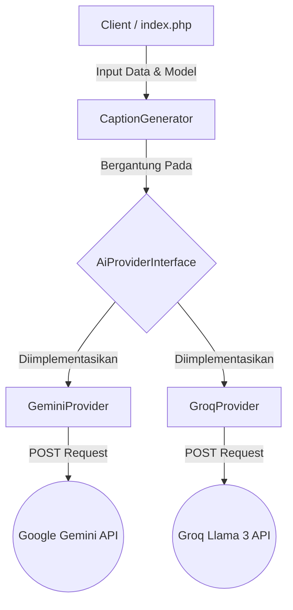

# Alur Kerja Sistem (System Workflow)

Dokumen ini menjelaskan secara sistematis tahapan eksekusi program "AI Social Media Caption Generator", dari saat pengguna memberikan input hingga kembalian *caption* selesai ditampilkan.

## Arsitektur Diagram Konseptual (Strategy Pattern)

## Alur Kerja Terperinci

### 1. Inisialisasi Aplikasi (Tahap UI)
- Pengguna mengakses aplikasi melalui browser (contoh: `http://localhost:8000/index.php`).
- Halaman memuat antarmuka berbasis Tailwind CSS.
- Form otomatis diisi dengan data pengujian skenario UTS: *Nama Produk* ("Sistemika") dan *Keunggulan* ("Layanan social media marketing untuk agensi digital").

### 2. Penyerahan Data (Form Submission)
- Pengguna memilih *Gaya Bahasa* dan tipe *Model AI* yang diinginkan (Gemini atau Groq) dari dropdown.
- Saat tombol **Generate Caption** ditekan, browser memaketkan form input dan mengirimkannya (via metode HTTP POST) kembali ke file `index.php`.

### 3. Pemrosesan Data & Validasi Backend
- Baris-baris pertama PHP di `index.php` menangkap request `$_POST`.
- Logika memeriksa validitas (memastikan input produk dan fitur tidak kosong).
- Sistem memanggil Strategy yang tepat menggunakan `if-else` sederhana terhadap pilihan dropdown `ai_model`:
  - Jika "gemini", maka Object di-inisialisasi: `new GeminiProvider()`.
  - Jika "groq", maka Object di-inisialisasi: `new GroqProvider()`.
- Model yang sudah menjadi instansi / objek ini lalu diinjeksi ke dalam kelas Konteks (`new CaptionGenerator($provider)`).

### 4. Eksekusi Kontrak (Strategy Pattern)
- `index.php` mengeksekusi metode generate utama (`$generator->generate()`).
- Karena pola strategi, `CaptionGenerator` tidak mempedulikan API apa yang digunakan, ia hanya memerintahkan model terkait untuk memanggil `generateCaption()`.

### 5. Proses API Eksternal (cURL)
- Di dalam kelas penyedia yang aktif (`GeminiProvider.php` atau `GroqProvider.php`), variabel teks rahasia diletakkan: instruksi larangan menggunakan nama personal.
- Kelas menyusun format JSON dan *Header* otentikasi.
- Menggunakan *Library cURL bawaan PHP*, server lokal menghubungi server Google / Groq. 
- Server eksternal merespons dengan hasil pembuatan kalimat/caption buatan AI.

### 6. Dekode Data (Parsing)
- Respon JSON dari AI di-dekode menggunakan `json_decode()` menjadi Array Asosiatif PHP.
- Blok `try-catch` memeriksa dan membedah array bersarang yang rumit untuk menemukan nilai *string/text* hasil akhir, memisahkan teks asli caption dari metadata API yang tidak diperlukan.

### 7. Pengembalian ke Pengguna (Render Hasil)
- String teks yang bersih dikembalikan melewati lapisan-lapisan fungsi tadi dan bermuara kembali di `index.php` sebagai variabel `$generatedCaption`.
- Di bagian HTML terbawah (Result Section), kotak hasil akan terbuka dan menampilkan teks *caption*.
- Pengguna dapat menyalin tulisan menggunakan tombol "Salin ke Clipboard" yang tersedia.
